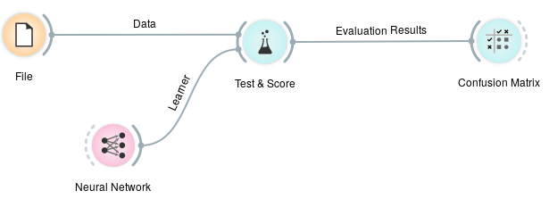
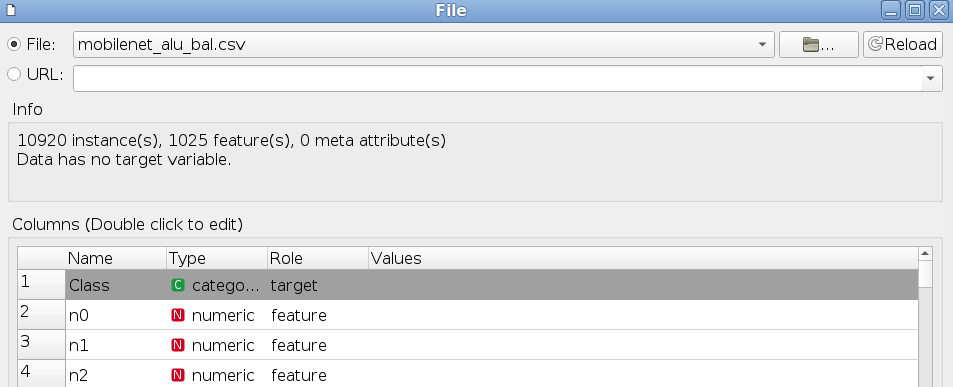
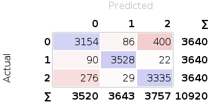

# Transfer Learning - Image Embeddings Generator

Transfer Learning - Image Embeddings Generator is a simple script that takes advantage of pre-trained deep convolutional neural networks (CNN) on ImageNet to generate a significant feature representation of an input image. 

### Motivation

When dealing with images, no matter how simple the project is, their naive vector representation (width * height * channels) can take an order of magnitude of tens of thousands of features, each! And despite the amount of memory space required, are all the pixels in an image relevant for a classification task? - No!

Transfer Learning for images, more specific Transferring Knowledge of Feature Representations, takes an image and do a forward pass in a CNN trained on another domain for a different task, and returns a low-dimensional representation of the given image. This new representation is expected to be a more significant and smaller vector of the input given that is the result of applying a sequence of pre-learned kernels.

___The main goal of this repository is to provide different image embeddings for a quick evaluation of machine learning algorithms trained on different representations of the input data.___

### Available pre-trained CNNs

| Model | Size | Feature vector size | Default input size | Minimum input size |
|:-----------------:|:------:|:-------------------:|:------------------:|:------------------:|
| Xception | 88 MB | (1, 2048) | (299, 299, 3) | (71, 71, 3) |
| VGG16 | 528 MB | (1, 4096) | (224, 224, 3) | (48, 48, 3) |
| VGG19 | 549 MB | (1, 4096) | (224, 224, 3) | (48, 48, 3) |
| ResNet50 | 99 MB | (1, 2048) | (224, 224, 3) | (197, 197, 3) |
| InceptionV3 | 92 MB | (1, 2048) | (299, 299, 3) | (139, 139, 3) |
| InceptionResNetV2 | 215 MB | (1, 1536) | (299, 299, 3) | (139, 139, 3) |
| MobileNet | 17 MB | (1, 1024) | (224, 224, 3) | (32, 32, 3) |

## Installation

### Requirements
Install all the requirements for Python 3 by running: 

`$ pip3 install -r requirements.txt`

## Usage

This repository is quite simple to use, with one main script. `generate_embedding.py` is responsible for generating the image embeddings with its default configurations set to save the embeddings as two npy files (embeddings data and labels) and use the VGG16 model trained on ImageNet. 

```console
$ cd transfer/
$ python generate_embedding.py -h

usage: generate_embedding.py [-h] [-csv CSV_FILE] [-data NPY_DATA]
                             [-labels NPY_LABELS] [-dir SAVE_FOLDER_PATH]
                             [-n [SAVE_NAME]] [-tm TRAINED_MODEL] [-to-csv]
                             [-he IMAGE_HEIGHT] [-w IMAGE_WIDTH]
                             [-c IMAGE_CHANNELS] [-weights NN_WEIGHTS]
                             [-b BATCH_SIZE]

Generate and save image embeddings using pre-trained models

optional arguments:
  -h, --help            show this help message and exit
  -csv CSV_FILE, --csv_file CSV_FILE
                        csv file (default=None)
  -data NPY_DATA, --npy_data NPY_DATA
                        npy data file (default=None)
  -labels NPY_LABELS, --npy_labels NPY_LABELS
                        npy label file (default=None)
  -dir SAVE_FOLDER_PATH, --save_folder_path SAVE_FOLDER_PATH
                        path to csv files to be saved (default= current
                        working directory)
  -n [SAVE_NAME], --save_name [SAVE_NAME]
                        name of new csv or npy file(s)
                        (default="transferfeature")
  -tm TRAINED_MODEL, --trained_model TRAINED_MODEL
                        trained_models: VGG16, VGG19, ResNet50, MobileNet,
                        Xception, InceptionV3,
                        InceptionResNetV2(default=VGG16)
  -to-csv, --save_csv   save resulting dataset as a csv file, default is
                        saving as npy files (data and labels separately)
                        (default=False)
  -he IMAGE_HEIGHT, --image_height IMAGE_HEIGHT
                        original image height number (default=90)
  -w IMAGE_WIDTH, --image_width IMAGE_WIDTH
                        original image width number (default=160)
  -c IMAGE_CHANNELS, --image_channels IMAGE_CHANNELS
                        original image channels (default=3)
  -weights NN_WEIGHTS, --nn_weights NN_WEIGHTS
                        None to load without pre-trained weights 
                        (default=imagenet)
  -b BATCH_SIZE, --batch_size BATCH_SIZE
                        run predictions on batch of given size (8, 16, 32,
                        64...). If default, images will be passed to the model
                        as they are preprocessed (default=1)
```

#### `-csv`
Path to csv file containing the labels and image paths to be processed in the embeddings generator. The csv file has to be structured in the following way: first column: <img_labels>, second column: <path_to_images> 

#### `-data`
Path to npy file containing a vectorized representation of images to be processed in the embeddings generator. If this option is selected, one has also to provide a `-labels` npy file.

#### `-labels`
Path to npy file containing the labels of the vectorized images to be processed in the embeddings generator. If this option is selected, one has also to provide a `-data` npy file.

#### `-dir`
Path to directory where the generated embeddings will be saved. Default is the current working directory.

#### `-n`
Name for the new file(s). Default is transferfeature.

#### `-tm`
Selection of the trained model to be used. Only a single model must be chosen. Default is VGG16.

#### `-to-csv`
Save the generated embeddings in a csv file, with header row formated as follows: Class, n0, n1, ..., n<`number_of_embedded_features - 1`>. Default is to save the embeddings as two `npy` files, one for the embedded images and another one for their corresponding labels.

#### `-he`
Specify the original height of the vector image in `-data` npy file. Only required for npy input files. Default is 90.

#### `-w`
Specify the original width of the vector image in `-data` npy file. Only required for npy input files. Default is 160.

#### `-c`
Specify the original number of channels of the vector image in `-data` npy file. Only required for npy input files. Default is 3. __Attention__: only 3-channel images are accepted in the current configuration of the pre-trained models.

#### `-weights`
Add this flag followed by `None` to use the selected model architecture without its learned weights. Default is to use the learned weights in `imagenet`. 

#### `-b`
The size of batches to be passed to the model for feature extraction. Default is to preprocess image by image, doing a forward pass in the network and storing the resulting embedding in a list.

__Attention__ when running the script for the first time using a specific `-tm` model, the selected model will be downloaded automatically in a hidden directory under the path specified by the environment variable `HOME`.

### Creating a subdataset for testing

Given two npy files containing image_data (`npy_data_file`) and labels (`<npy_labels_file>`), is possible to run the script `sample_toy_data.py` to sample and save a subset for testing/debugging purposes.

```console
$ cd transfer/toy_dataset/
$ python sample_toy_data.py <npy_data_file> <npy_labels_file> -h

usage: sample_toy_data.py [-h] [-s NUM_SAMPLES] [-n NAME_NPY]
                          npy_data npy_labels

Generate a toy dataset given an npy (data and labels) input files

positional arguments:
  npy_data              npy data file
  npy_labels            npy label file

optional arguments:
  -h, --help            show this help message and exit
  -s NUM_SAMPLES, --num_samples NUM_SAMPLES
                        number of samples (default=100)
  -n NAME_NPY, --name_npy NAME_NPY
                        name of new file (default=toy)
```

## Usage example - Orange

One possible use of this repository is to preprocess large image datasets before passing them to visual programming machine learning tools such as [Orange](https://orange.biolab.si/).

The following is a simple example using a dataset of 10.920 image instances of size 60x80x3, wherein the goal is to use these embeddings for training a shallow neural network in Orange canvas. 

```console
$ python generate_embedding.py -data alu_bal_60_80_3_data.npy -labels alu_bal_60_80_3_labels.npy -dir . -n mobilenet_alu_bal -he 60 -w 80 -tm MobileNet -to-csv

Generating embeddings |################################| 10920/10920
Data shape (10920, 1024), Labels shape (10920, 1)
```

After successfully running the script, `mobilenet_alu_bal.csv` file should be located at the current directory. 

In Orange canvas is possible to load this file with `File` widget and build the following workflow:


After loading the data is mandatory to tell Orange which feature is the target, as follows:



When training and evaluation process are finished, is possible to chech the results at `Test & Score` widget. The evaluation results using 10-fold stratified cross validation for the given workflow are:

| Method | AUC | CA | F1 | Precision | Recall |
|----------------|-------|-------|-------|-----------|--------|
| Neural Network | 0.982 | 0.917 | 0.917 | 0.917 | 0.917 |

Confusion matrix:




__IMPORTANT__ is interesting noticing that even though Orange Image Analytics add-on doesn't support MobileNet for image embedding is possible to train machine learning models on this data using this method.

## Built with 
* Keras
* TensorFlow

## Contributing
Pull requests are welcome. For major changes, please open an issue first to discuss what you would like to change.

Please make sure to update tests as appropriate.

### Citation
```
@misc{deeplearning_image_embeddings2018,
    author = {Paula Moraes},
    title = {Transfer Learning - Image Embeddings Generator},
    year = {2018},
    howpublished = {\url{https://github.com/paulaksm/transfer-learning}},
    note = {commit xxxxxxx}
  }
```

## License
[MIT](https://choosealicense.com/licenses/mit/)

## References
[Keras pre-trained models](https://keras.io/applications/)
